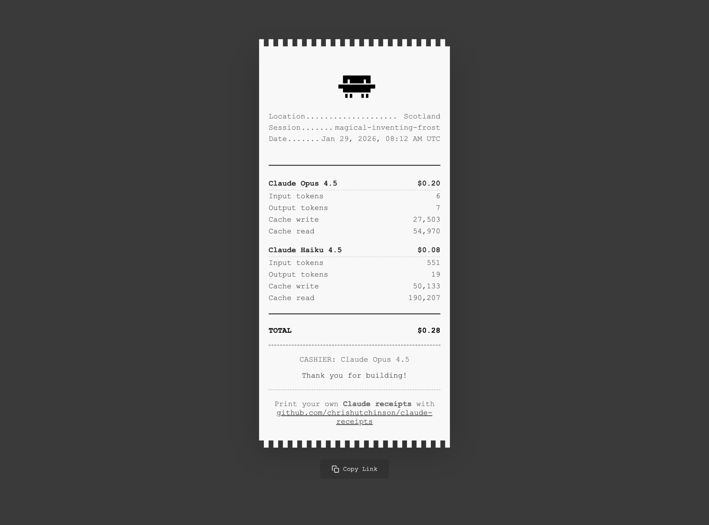

# claude-receipts

> Bring receipts from your Claude Code sessions



## Installation

```bash
npx claude-receipts setup
```

This will:

- Configure the `SessionEnd` hook in your global `~/.claude/settings.json`
- Create a config file at `~/.claude-receipts.config.json`

From now on, every time you exit a Claude Code session, your receipt will be generated and opened in your browser.

### Manual generation

Generate a receipt for your most recent session:

```bash
npx claude-receipts generate
```

## Commands

### `generate`

Generate a receipt for a Claude Code session.

```bash
# Generate for most recent session
npx claude-receipts generate

# Generate HTML (saved to ~/.claude-receipts/projects/)
npx claude-receipts generate --output html

# Override location
npx claude-receipts generate --location "Paris, France"
```

**Options:**

- `-s, --session <id>` - Generate for a specific session ID
- `-o, --output <format>` - Output format: "html" or "console" (default: console)
- `-l, --location <text>` - Override location detection

**Output Formats:**

- `html` - Beautiful styled receipt saved to `~/.claude-receipts/projects/`
- `console` - ASCII art display in terminal

### `setup`

Configure automatic receipt generation.

```bash
# Run interactive setup
npx claude-receipts setup

# Uninstall the hook
npx claude-receipts setup --uninstall
```

This modifies `~/.claude/settings.json` to add a SessionEnd hook that automatically generates receipts.

### `config`

Manage your receipt configuration.

```bash
# Show current configuration
npx claude-receipts config --show

# Set a configuration value
npx claude-receipts config --set location="Kuala Lumpur, Malaysia"
npx claude-receipts config --set enableConsole=true

# Reset to defaults
npx claude-receipts config --reset
```

**Available settings:**

- `location` - Default location (string)
- `timezone` - Timezone for dates (string, e.g., "Asia/Macau")

## Configuration

Configuration is stored at `~/.claude-receipts.config.json`.

**Default configuration:**

```json
{
  "version": "1.0.0"
}
```

**Optional settings:**

- `location` - Custom location string (otherwise auto-detected)
- `timezone` - Custom timezone for date formatting

### Location Detection

Location is determined in this order:

1. `--location` flag (if provided)
2. Config file `location` setting
3. Auto-detection via IP geolocation (offline, using geoip-lite)
4. Fallback: "The Cloud"

## How It Works

1. **SessionEnd Hook**: When you exit Claude Code, it calls `npx claude-receipts generate --output html` via stdin
2. **Data Collection**: The package calls `ccusage` (bundled) to get session token/cost data
3. **Transcript Parsing**: Reads the session transcript JSONL to extract metadata
4. **Receipt Generation**: Bakes a HTML page with all the details on a styled receipt
5. **Auto-open**: Opens the receipt in your default browser automatically
6. **Auto-save**: Saves to `~/.claude-receipts/projects/[session-name].html`

## Requirements

- Node.js >= 22.0.0
- Claude Code (for automatic generation)

## Troubleshooting

### "Cannot determine transcript path"

This means you're trying to manually generate a receipt but the most recent session doesn't have a valid project path. Solutions:

- Run from within a SessionEnd hook (use `setup` command)
- Work in a Claude Code session and let it auto-generate

### "No session data found"

ccusage couldn't find any sessions. Make sure you've used Claude Code recently and that ccusage is working:

```bash
npx ccusage session --json
```

### Hook not triggering

Check that the hook is installed:

```bash
cat ~/.claude/settings.json
```

You should see a `SessionEnd` hook pointing to `claude-receipts`.

## Contributing

## Roadmap

- [x] HTML receipts with auto-open in browser
- [x] Console ASCII art mode
- [ ] Image export
- [ ] Real receipt printing
- [ ] Plugin for Opencode ([opencode issue](https://github.com/anomalyco/opencode/issues/10524))

## License

MIT
