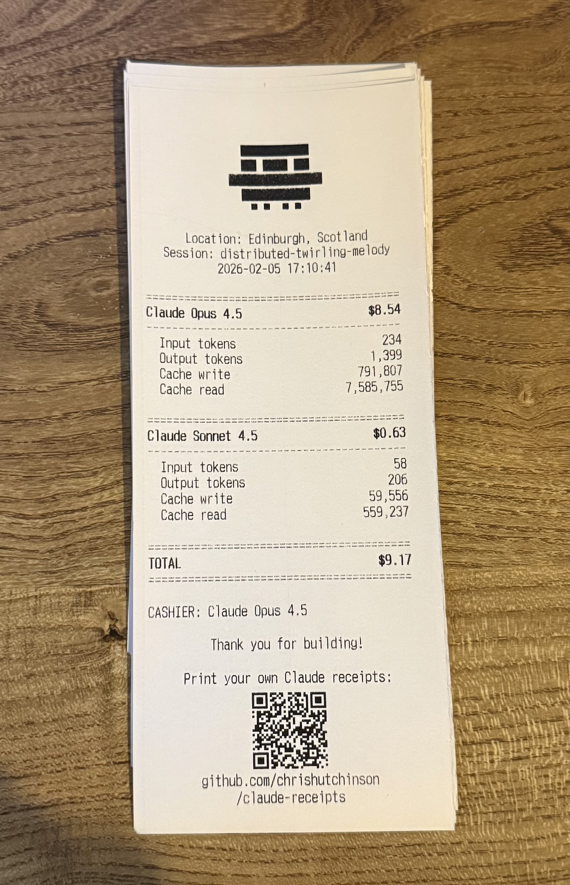

# claude-receipts

> Bring receipts from your Claude Code sessions

<details>

<summary><strong>Examples</strong></summary>

## Thermal printer receipt



## HTML receipt


</details>

## Installation

```bash
npx claude-receipts setup
```

This will:

- Configure the `SessionEnd` hook in your global `~/.claude/settings.json`
- Create a config file at `~/.claude-receipts.config.json`

From now on, every time you exit a Claude Code session, your receipt will be generated and opened in your browser.

### Manual generation

Generate a receipt for your most recent session:

```bash
npx claude-receipts generate
```

## Commands

### `generate`

Generate a receipt for a Claude Code session.

```bash
# Generate for most recent session
npx claude-receipts generate

# Generate HTML (saved to ~/.claude-receipts/projects/)
npx claude-receipts generate --output html

# Print to thermal printer
npx claude-receipts generate --output printer --printer usb

# Multiple outputs (HTML + printer)
npx claude-receipts generate --output html,printer

# Specific session by UUID prefix
npx claude-receipts generate --session 9356d5e2

# Override location
npx claude-receipts generate --location "Paris, France"
```

**Options:**

- `-s, --session <id>` - Generate for a specific session ID or UUID prefix
- `-o, --output <format>` - Output format: "html", "console", or "printer" (supports multiple, comma-separated)
- `-l, --location <text>` - Override location detection
- `-p, --printer <name>` - Printer interface (e.g., "usb", "tcp://192.168.1.100")

**Output Formats:**

- `html` - Beautiful styled receipt saved to `~/.claude-receipts/projects/`
- `console` - ASCII art display in terminal
- `printer` - Send to thermal printer (requires Epson TM-T88V or compatible)

### `setup`

Configure automatic receipt generation.

```bash
# Run interactive setup
npx claude-receipts setup

# Uninstall the hook
npx claude-receipts setup --uninstall
```

This modifies `~/.claude/settings.json` to add a SessionEnd hook that automatically generates receipts.

### `config`

Manage your receipt configuration.

```bash
# Show current configuration
npx claude-receipts config --show

# Set a configuration value
npx claude-receipts config --set location="Kuala Lumpur, Malaysia"
npx claude-receipts config --set timezone="Asia/Kuala_Lumpur"
npx claude-receipts config --set printer=usb

# Reset to defaults
npx claude-receipts config --reset
```

**Available settings:**

- `location` - Default location (string)
- `timezone` - Timezone for dates (string, e.g., "Asia/Macau")
- `printer` - Default printer interface (string, e.g., "usb" or "tcp://192.168.1.100")

## Configuration

Configuration is stored at `~/.claude-receipts.config.json`.

**Default configuration:**

```json
{
  "version": "1.0.0"
}
```

**Optional settings:**

- `location` - Custom location string (otherwise auto-detected)
- `timezone` - Custom timezone for date formatting
- `printer` - Default printer interface for thermal printing

### Location Detection

Location is determined in this order:

1. `--location` flag (if provided)
2. Config file `location` setting
3. Auto-detection via IP geolocation (offline, using geoip-lite)
4. Fallback: "The Cloud"

## How It Works

1. **SessionEnd Hook**: When you exit Claude Code, it calls `npx claude-receipts generate --output html` via stdin with the session ID
2. **Data Collection**: The package calls `ccusage session --id <session-id>` to get accurate session token/cost data
3. **Transcript Parsing**: Reads the session transcript JSONL to extract metadata (session name, timestamps, message count)

### HTML output

4. **Receipt Generation**: If `--output html` is specified, generates a styled HTML receipt with token breakdowns by model
5. **Output**: Saves HTML to `~/.claude-receipts/projects/[session-name].html` and/or prints to thermal printer
6. **Auto-open**: Opens the HTML receipt in your default browser automatically (hook mode only)

### Printer output

1. **Thermal Printing**: If `--output printer` is specified, sends the receipt to a thermal receipt printer

## Requirements

- Node.js >= 22.0.0
- Claude Code (for automatic generation)

## Thermal Printing

claude-receipts supports printing to Epson TM-T88V thermal printers (and compatible models) via:

- **USB**: Auto-detect via `--printer usb` (or `config --set printer=usb`)
- **Network**: Direct TCP via `--printer tcp://192.168.1.100`

> [!WARNING]
> Your mileage with printing may vary. I have tested with an Epson TM-T88V, printing from macOS and it works well, but other models may have different capabilities or require adjustments to the code. I am more than happy to accept PRs to improve printer compatibility.

The receipt includes:

- Claude ASCII logo
- Session details and location
- Token breakdown by model (input, output, cache read/write)
- Total cost
- QR code linking to the GitHub repo

## Troubleshooting

### "Cannot determine transcript path"

This means you're trying to manually generate a receipt but the most recent session doesn't have a valid project path. Solutions:

- Run from within a SessionEnd hook (use `setup` command)
- Work in a Claude Code session and let it auto-generate

### "No session data found"

ccusage couldn't find any sessions. Make sure you've used Claude Code recently and that ccusage is working:

```bash
npx ccusage session --json
```

### Hook not triggering

Check that the hook is installed:

```bash
cat ~/.claude/settings.json
```

You should see a `SessionEnd` hook pointing to `claude-receipts`.

### Session shows wrong cost or is missing

Very short sessions (e.g., just "hello world" + immediate exit) may not appear in ccusage yet. The hook will exit silently rather than printing a wrong receipt. For sessions that exist, the package now uses `ccusage session --id` to fetch accurate totals rather than sub-session slices.

### Printer not found

If using `--printer usb`, ensure:

- Printer is connected via USB
- Printer is an Epson TM-T88V or compatible ESC/POS model
- On Linux, you may need permission to access USB devices (`/dev/usb/lp*`)

For network printers, use `--printer tcp://<ip-address>` with port 9100 (default ESC/POS port).

## Contributing

## Roadmap

- [x] HTML receipts with auto-open in browser
- [x] Console ASCII art mode
- [x] Real thermal receipt printing (Epson TM-T88V)
- [x] Accurate session cost tracking (via `ccusage --id`)
- [x] Session matching by UUID or prefix
- [ ] Image export (PNG/JPEG)
- [ ] Plugin for Opencode ([opencode issue](https://github.com/anomalyco/opencode/issues/10524))

## License

MIT
