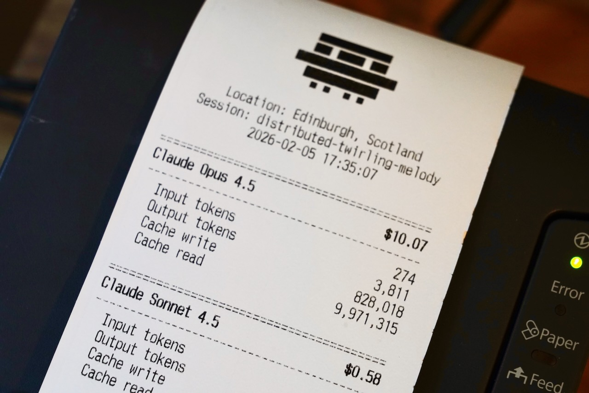
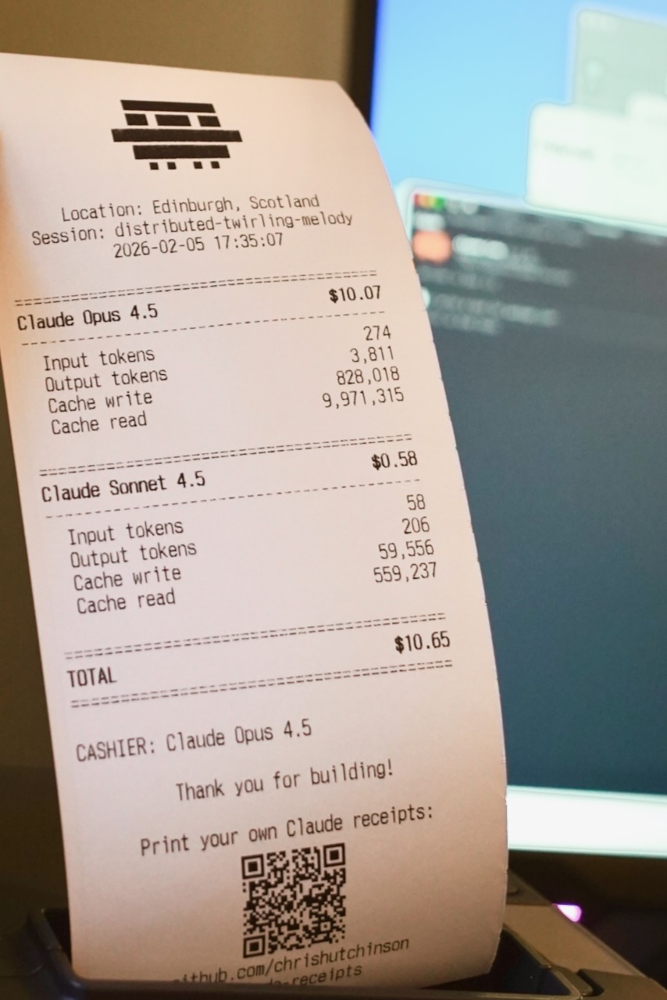
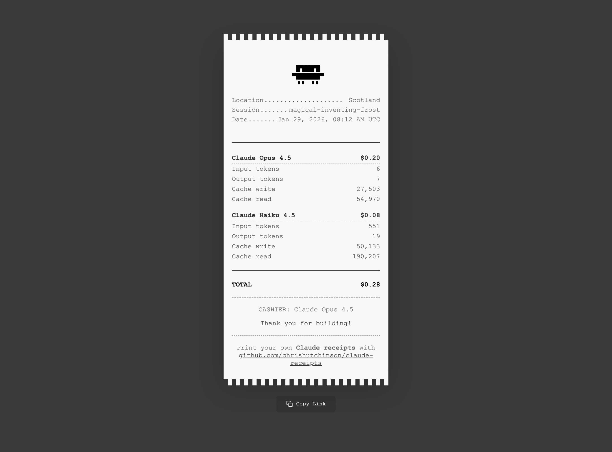

# Claude Receipts

> **A note from the author:**
>
> This has been one of my favourite creative side projects yet (and just in time for Opus 4.6).
>
> I picked up a second hand receipt printer and hooked it up to Claude Code's `SessionEnd` hook. With some `ccusage` wrangling, a receipt is printed, showing a breakdown of that session's spend by model, along with token counts.
>
> It's dumb, the receipts are beautiful, and I love it so much.
>
> I hope you enjoy it too.



<details>

<summary><strong>More photos / screenshots</strong></summary>

## Full thermal receipt



## HTML receipt



</details>

## Installation

```bash
npx claude-receipts setup
```

This will:

- Configure the `SessionEnd` hook in your global `~/.claude/settings.json`
- Create a config file at `~/.claude-receipts.config.json`

From now on, every time you exit a Claude Code session, your receipt will be generated and opened in your browser.

### Manual generation

Generate a receipt for your most recent session:

```bash
npx claude-receipts generate
```

## Commands

### `generate`

Generate a receipt for a Claude Code session.

```bash
# Generate for most recent session
npx claude-receipts generate

# Generate HTML (saved to ~/.claude-receipts/projects/)
npx claude-receipts generate --output html

# Print to thermal printer (defaults to Epson TM-T88V)
npx claude-receipts generate --output printer --printer usb

# Print to an Epson TM-T88VII over USB
npx claude-receipts generate --output printer --printer usb --printermodel t88vii

# Multiple outputs (HTML + printer)
npx claude-receipts generate --output html,printer

# Specific session by UUID prefix
npx claude-receipts generate --session 9356d5e2

# Override location
npx claude-receipts generate --location "Paris, France"
```

**Options:**

- `-s, --session <id>` - Generate for a specific session ID or UUID prefix
- `-o, --output <format>` - Output format: "html", "console", or "printer" (supports multiple, comma-separated)
- `-l, --location <text>` - Override location detection
- `-p, --printer <name>` - Printer interface (e.g., "usb", "tcp://192.168.1.100")
- `--printermodel <model>` - Epson model when `--printer usb`: `t88v` (default) or `t88vii`

**Output Formats:**

- `html` - Beautiful styled receipt saved to `~/.claude-receipts/projects/`
- `console` - ASCII art display in terminal
- `printer` - Send to thermal printer (requires Epson TM-T88V, TM-T88VII, or compatible)

### `setup`

Configure automatic receipt generation.

```bash
# Run interactive setup
npx claude-receipts setup

# Uninstall the hook
npx claude-receipts setup --uninstall
```

This modifies `~/.claude/settings.json` to add a SessionEnd hook that automatically generates receipts.

### `config`

Manage your receipt configuration.

```bash
# Show current configuration
npx claude-receipts config --show

# Set a configuration value
npx claude-receipts config --set location="Kuala Lumpur, Malaysia"
npx claude-receipts config --set timezone="Asia/Kuala_Lumpur"
npx claude-receipts config --set printer=usb
npx claude-receipts config --set printermodel=t88vii

# Reset to defaults
npx claude-receipts config --reset
```

**Available settings:**

- `location` - Default location (string)
- `timezone` - Timezone for dates (string, e.g., "Asia/Macau")
- `printer` - Default printer interface (string, e.g., "usb" or "tcp://192.168.1.100")
- `printermodel` - Epson model for USB printing: `t88v` (default) or `t88vii`

## Configuration

Configuration is stored at `~/.claude-receipts.config.json`.

**Default configuration:**

```json
{
  "version": "1.0.0"
}
```

**Optional settings:**

- `location` - Custom location string (otherwise auto-detected)
- `timezone` - Custom timezone for date formatting
- `printer` - Default printer interface for thermal printing
- `printermodel` - Epson model for USB printing: `t88v` (default) or `t88vii`

### Location Detection

Location is determined in this order:

1. `--location` flag (if provided)
2. Config file `location` setting
3. Auto-detection via IP geolocation (offline, using geoip-lite)
4. Fallback: "The Cloud"

## How It Works

1. **SessionEnd Hook**: When you exit Claude Code, it calls `npx claude-receipts generate --output html` via stdin with the session ID
2. **Data Collection**: The package calls `ccusage session --id <session-id>` to get accurate session token/cost data. In manual mode, when ccusage returns project-aggregated entries (recent ccusage versions), it scans `~/.claude/projects/` directly to locate the most recent transcript and then fetches its totals via `--id`.
3. **Transcript Parsing**: Reads the session transcript JSONL to extract metadata (session name, timestamps, message count). The session name is derived as `<project-basename>-<uuid-prefix>` from the transcript's `cwd` and `sessionId`.

### HTML output

4. **Receipt Generation**: If `--output html` is specified, generates a styled HTML receipt with token breakdowns by model
5. **Output**: Saves HTML to `~/.claude-receipts/projects/[session-name].html` and/or prints to thermal printer
6. **Auto-open**: Opens the HTML receipt in your default browser automatically (hook mode only)

### Printer output

1. **Thermal Printing**: If `--output printer` is specified, sends the receipt to a thermal receipt printer

## Requirements

- Node.js >= 22.0.0
- Claude Code (for automatic generation)

## Thermal Printing

claude-receipts supports printing to Epson TM-T88V and TM-T88VII thermal printers (and compatible models) via:

- **USB**: `--printer usb` (defaults to TM-T88V; add `--printermodel t88vii` for the VII)
- **Network**: Direct TCP via `--printer tcp://192.168.1.100`
- **Specific USB device**: `--printer usb:VID:PID` (overrides `--printermodel`)

The two USB Product IDs targeted out of the box (vendor `04b8`):

| Model       | Product ID |
| ----------- | ---------- |
| TM-T88V     | `0x0202`   |
| TM-T88VII   | `0x0e28`   |

> [!WARNING]
> Your mileage with printing may vary. I have tested with an Epson TM-T88V, printing from macOS and it works well, but other models may have different capabilities or require adjustments to the code. I am more than happy to accept PRs to improve printer compatibility.

The receipt includes:

- Claude ASCII logo
- Session details and location
- Token breakdown by model (input, output, cache read/write)
- Total cost
- QR code linking to the GitHub repo

## Troubleshooting

### "No transcript files found in ~/.claude/projects/"

Manual generation falls back to scanning `~/.claude/projects/` for the most recent transcript when ccusage returns project-aggregated entries. If you see this error, either you haven't used Claude Code yet (no transcripts written), or `~/.claude/projects/` is empty. Run a Claude Code session first.

### "No session data found"

ccusage couldn't find any sessions. Make sure you've used Claude Code recently and that ccusage is working:

```bash
npx ccusage session --json
```

### Hook not triggering

Check that the hook is installed:

```bash
cat ~/.claude/settings.json
```

You should see a `SessionEnd` hook pointing to `claude-receipts`.

### Session shows wrong cost or is missing

Very short sessions (e.g., just "hello world" + immediate exit) may not appear in ccusage yet. The hook will exit silently rather than printing a wrong receipt. For sessions that exist, the package now uses `ccusage session --id` to fetch accurate totals rather than sub-session slices.

### Printer not found

If using `--printer usb`, ensure:

- Printer is connected via USB
- Printer is an Epson TM-T88V, TM-T88VII, or compatible ESC/POS model
- For a TM-T88VII, pass `--printermodel t88vii` (or `config --set printermodel=t88vii`) so the right USB Product ID is targeted
- On Linux, you may need permission to access USB devices (`/dev/usb/lp*`)

For network printers, use `--printer tcp://<ip-address>` with port 9100 (default ESC/POS port).

### TM-T88VII over network: command succeeds but nothing prints

If `claude-receipts` reports the receipt was sent successfully but no paper comes out, your TM-T88VII is likely running in **TM-Intelligent** mode with **Secure Print** enabled. In that configuration, port 9100 still accepts TCP connections (and even advertises raw print via mDNS) but the printer silently discards ESC/POS data — real printing happens over the ePOS-Print HTTPS API instead.

How to confirm:

- The printer's web UI shows `TM-i Firmware Version`, an `ePOS-Print Version`, and "Secure printing" enabled.
- A quick probe returns no response: `printf '\x10\x04\x01' | nc 192.168.1.221 9100` should normally print a single status byte instantly on a TM-T88 in standard mode.

Fix (switches the printer to behave like a TM-T88V on the wire):

1. Open the printer's web UI (`https://<printer-ip>/`).
2. Advanced → **TM-Intelligent**: disable.
3. Advanced → ePOS-Device / ePOS-Print → **Secure Print**: disable.
4. Advanced → Network Printer Settings: confirm raw print is enabled on port 9100.
5. Save, then **power-cycle the printer** (a soft reset isn't always enough — the print pipeline only fully reattaches on a cold boot).

## Contributing

```bash
# Install dependencies
npm install

# Build TypeScript
npm run build

# Watch mode during development
npm run dev

# Run tests
npm test

# Watch tests
npm run test:watch

# Try the CLI locally without publishing
npm link
claude-receipts generate
```

PRs welcome — especially printer compatibility improvements.

## Roadmap

- [x] HTML receipts with auto-open in browser
- [x] Console ASCII art mode
- [x] Real thermal receipt printing (Epson TM-T88V)
- [x] Accurate session cost tracking (via `ccusage --id`)
- [x] Session matching by UUID or prefix
- [ ] Image export (PNG/JPEG)
- [ ] Plugin for Opencode ([opencode issue](https://github.com/anomalyco/opencode/issues/10524))

## License

MIT
